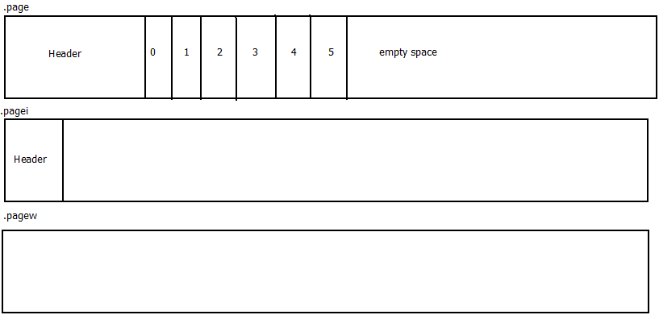

# storage format
storage is a set of pages. each pages represent by 3 files:

 

The **.page** file contains measurements in order of their writting. no sorting, no merging, no compressing.
All for fast write speed.

Before write to page, nkvdb store data to cache. Cache is just an array and write speed to it is very fast.
When array is full (max size of array **nkvdb::defaultcacheSize**), the new portion of data will send to async writer, 
and for new data nkvdb will take new cache from cache pool.

## Index file
Based on [B+ tree.](https://en.wikipedia.org/wiki/B%2B_tree)

## Async writer

nkvdb operate page file as mapped file. nkvdb just take full cache and just write it to the mapped file.
And here nkvdb write to .pagei index info for future read queries.

## When page is full.
When the page has filled up, the .pagew file contains the very latest value of the measurement. Thats do for reads data in time point and may save time for scanning pages to past.
