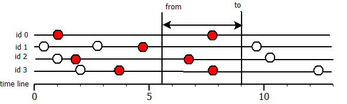
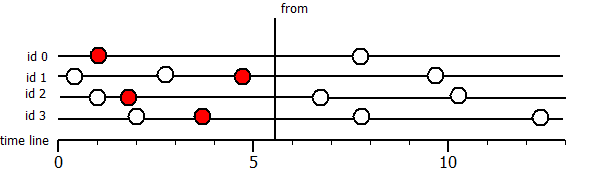

# Overview
Again. nkvdb is a not key value database. you can`t get value by key, but you
may query data by interval. or query data in time point.

for example, we have



Horizontal lines is time-line for measurments with *id* 0-3. 

## read intervals

if you query like in this listing

```C++ 
auto reader=ds->readInterval(from,to);
nkvdb::Meas::MeasList output;
reader->readAll(&output);
```

**output**  contains values, which marked red color in picture.

## read in time point
if you execute that query

```C++
auto reader=ds->readInTimePoint(from);
nkvdb::Meas::MeasList output;
reader->readAll(&output);
```

you get values, which time less or equal of **from**.

